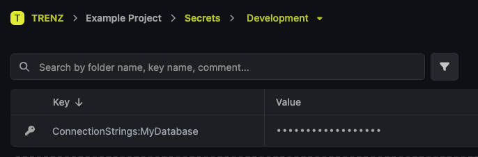

# InfisicalExtensions

This project adds extension methods for the [Infisical .NET SDK](https://infisical.com/docs/sdks/languages/csharp) to
register it as a configuration provider in your .NET app.

## Usage

Add your infisical settings to `appsettings.json`:

```json
{
  "Infisical": {
    "ClientId": "07ebc18f-df32-475a-8fef-1bdd79a5c7ac",
    "ClientSecret": "insert-your-client-secret",
    "SiteUrl": "https://<your infisical host>",
    "ProjectId": "some-project-id"
  }
}
```

Call `AddInfisicalConfiguration` on your application builder:

```csharp
var builder = WebApplication.CreateBuilder(args);

builder.AddInfisicalConfiguration();

// ...
```

This will add a `InfisicalConfigurationProvider` that provides all available secrets through `IConfiguration`.

---

Suppose you want to store your connection string in Infisical.

You first need to add a secret in the respective environment through the infisical interface:

> Note that infisical doesn't support nested secrets. The keys of the secrets need to include ":" to represent nested
> keys in an `appsettings.json`.



Then, in code, you can inject `IConfiguration` in your class and access its value as if it was in your
`appsettings.json`:

```csharp
public class MyConnectionStringProvider(IConfiguration configuration) {
    public string GetConnectionString() {
        // The following call looks up the key "ConnectionStrings:MyDatabase" in IConfiguration
        return configuration.GetConnectionString("MyDatabase");
    }
}
```

You could also access the key directly using:

```csharp
var connectionString = configuration["ConnectionStrings:MyDatabase"];
```

## Installation

```bash
dotnet add package TRENZ.Extensions.Infisical
```

## License

Licensed under MIT. For more information, see [LICENSE](LICENSE)
